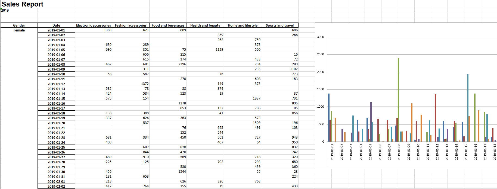

# Membuat daily gross revenue report per-product per Gender menggunakan OOP

## Context
Kita mendapatkan suatu tugas dari tim bisnis untuk membuat laporan berupa excel yang perlu dikirim dengan frekuensi tertentu, misal per hari melalui channel Discord.
Disini kita bisa menggunakan Python untuk melakukan proses automasi pengiriman report melalui channel Discord

## Dataset
Dataset yang akan digunakan adalah:
https://www.kaggle.com/datasets/aungpyaeap/supermarket-sales. Data dari link berikut berupa .csv, kita bisa mengubahnya dulu menjadi excel atau kita bisa gunakan dataset yang tersedia pada repo ini.
Dataset akan disaring untuk mengetahui daily gross revenue selama Januari-Maret 2019.

## Layout

## Kirim Report ke Discord
Untuk dapat mengirim report ini melalui discord, kita perlu membuat webhook terlebih dahulu.
- Buat server pribadi
- Buat channel dengan nama #report
- Lalu klik logo gear -> Edit Channel
- Pilih Integration
- Create new Webhook
- Salin Webhook URL ke configs > webhook.json

## Membuat virtual env menggunakan Anaconda

- Buka Anaconda Navigator
- Pilih menu Environment > Create > Nama Environment > Create
- Klik environment yang dibuat untuk aktivasi
- Launch VS Code/Pycharm melalui Anaconda Navigator

## Menjalankan kode automasi
- Folder report > main > excel_report.py
